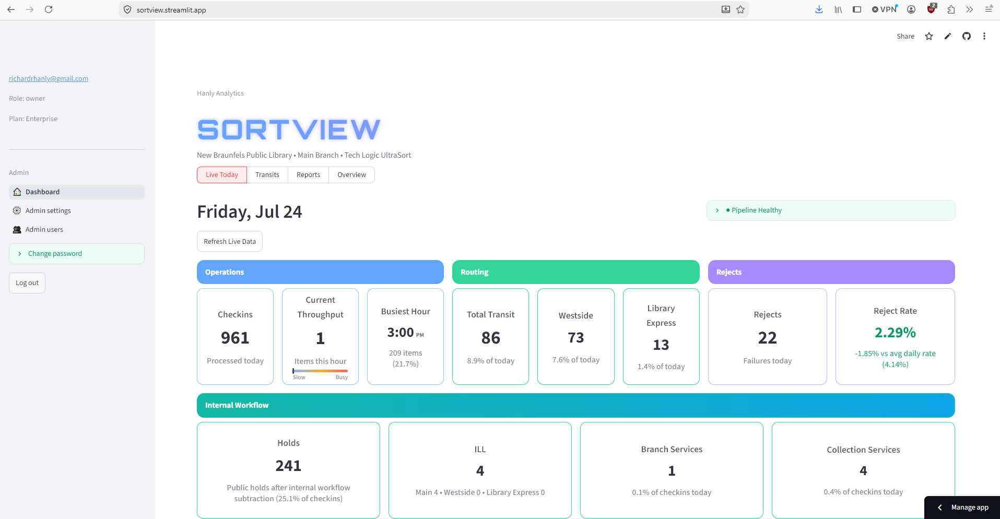

# SortView


**Live demo**

[](https://sortview.streamlit.app/?guest=1)

Click the link above to log directly into the app as a guest — no login required.

Guest login only works on deployments that explicitly opt into it. It's controlled by
`SORTVIEW_DEMO_MODE_ENABLED=true` plus `SORTVIEW_GUEST_EMAIL` / `SORTVIEW_GUEST_PASSWORD`;
there is no default guest account baked into the code, so a real customer deployment simply
doesn't have this feature unless someone deliberately turns it on.

SortView is a full-stack analytics and monitoring system for Automated Materials Handler operations in library environments.

It collects sorter activity from a Windows-based agent, processes and uploads the data through a FastAPI backend, stores it in Neon PostgreSQL, and presents operational insights through a Streamlit dashboard.

The project was built around New Braunfels Public Library and Tech Logic UltraSort workflows, while supporting a broader multi-library and multi-tenant architecture.

---

## Dashboard Preview

<p align="center">
  
</p>

---


## Demonstration of the AMH scanning and sorting a library material by it's RFID tag.


https://github.com/user-attachments/assets/46c64d68-90d8-4439-b8ac-3eb0a2b20a2c


---

## Key Features
* Automated ingestion of AMH check-in, reject, and ACS logs
* Incremental file processing that avoids re-uploading previously handled records
* FastAPI endpoints for authenticated data uploads
* Neon PostgreSQL storage and reporting
* Live operational metrics and pipeline health monitoring
* Transit-time and materials-flow analysis
* Reject analysis and alert generation
* Multi-tenant library support
* Alembic-managed database migrations
* Automated tests for parsing, metrics, alerts, and business logic
* Agent retry and exponential backoff behavior

---

## Architecture

```text
Tech Logic UltraSort / TLC Logs
              |
              v
Windows AMH Agent
- Reads local log files
- Parses new records
- Tracks processing state
- Retries failed uploads
              |
              v
FastAPI Backend
- Authenticates agent
- Validates uploads
- Records pipeline status
- Writes operational data
              |
              v
Neon PostgreSQL
- System of record
- Multi-library data model
- Alembic schema tracking
              |
              v
Streamlit Dashboard
- Daily operations
- Transit analytics
- Reject analysis
- Alerts
- Pipeline health
- Super-admin tools
```

---

## System Components

### Windows AMH Agent

The agent runs on the Windows machine connected to the automated materials handler.

It:

* Reads Tech Logic and TLC log files
* Parses check-in, reject, and ACS activity
* Processes only newly added records
* Uploads batches to the backend API
* Maintains local state and pipeline-status files
* Retries failed uploads using backoff behavior

The source-of-truth agent code is stored in `agent/`. The production copy is manually deployed to the AMH-connected machine after validation.

### FastAPI Backend

The backend receives and validates agent uploads before storing them in Neon.

Primary endpoints:

```text
POST /upload
POST /upload-pipeline-status
```

Responsibilities include:

* Agent authentication
* Request validation
* Database writes
* Duplicate-handling support
* Pipeline-health reporting

### Streamlit Dashboard

The dashboard reads data from Neon and provides:

* Live daily sorter activity
* Check-in and reject metrics
* Transit-time reporting
* Materials-flow analysis
* Alert conditions
* Agent and pipeline status
* Administrative and multi-tenant features

### PostgreSQL Database

Neon PostgreSQL serves as the system-of-record database.

Schema changes are tracked through Alembic rather than being created dynamically inside application startup or request handlers.

---

## Repository Structure

```text
amh-analytics-dashboard/
├── agent/                  # AMH agent and parser code
├── alembic/                # Database migration files
├── src/                    # Streamlit dashboard
├── super_admin/            # Super-admin pages and authentication
├── tests/                  # Automated tests
├── alembic.ini             # Alembic configuration
├── main.py                 # FastAPI backend entrypoint
├── packages.txt            # Deployment system packages
├── requirements.txt        # Python dependencies
└── README.md
```

### Important Directories

#### `agent/`

```text
agent/
├── run_pipeline.py
├── parse_checkins.py
├── parse_rejects.py
├── parse_acs.py
├── uploader.py
├── config.py
└── logger_config.py
```

#### `src/`

Key dashboard components include:

```text
src/
├── app.py
├── data_loader.py
├── metrics.py
├── alerts.py
├── transit_logic.py
├── reject_logic.py
├── views/
├── services/
└── pages/
```

#### `tests/`

Automated tests cover:

* Alert logic
* Dashboard metrics
* Transit calculations
* Reject analysis
* AMH log parsing
* Pipeline behavior

---

## Local Setup

### 1. Clone the repository

```bash
git clone <repository-url>
cd amh-analytics-dashboard
```

### 2. Create a virtual environment

Windows:

```powershell
python -m venv .venv
.venv\Scripts\activate
```

macOS or Linux:

```bash
python -m venv .venv
source .venv/bin/activate
```

### 3. Install dependencies

```bash
pip install -r requirements.txt
```

### 4. Configure environment variables

Create a local environment file containing the required application settings.

Example:

```env
DATABASE_URL=
AGENT_API_KEY=
```

Do not commit production credentials or database connection strings.

---

## Running the Application

### Streamlit Dashboard

```bash
streamlit run src/app.py
```

### FastAPI Backend

```bash
python main.py
```

Production deployment may use a platform-specific startup command or process manager.

### AMH Agent

Run the complete pipeline:

```bash
python -m agent.run_pipeline
```

Run individual parsers:

```bash
python -m agent.parse_checkins
python -m agent.parse_rejects
python -m agent.parse_acs
```

The production agent runs from a deployed copy on the AMH-attached Windows machine rather than directly from the repository.

---

## Database Migrations

SortView uses Alembic to track and apply schema changes.

Check the current database revision:

```bash
alembic current
```

Create a migration:

```bash
alembic revision -m "describe the schema change"
```

Apply all pending migrations:

```bash
alembic upgrade head
```

The live database has already been baselined in Alembic.

Future schema changes should be implemented through migrations. A fresh database can be built entirely with `alembic upgrade head` — the baseline migration reconstructs the full schema.

---

## Testing

Run the complete test suite:

```bash
python -m pytest
```

Run a specific test file:

```bash
python -m pytest tests/test_alerts.py
```

The test suite verifies core logic separately from the live AMH environment and production database.

---

## Reliability and Security

SortView includes several safeguards for production-like operation:

* Agent authentication for upload endpoints
* Incremental parsing to prevent unnecessary reprocessing
* Retry and backoff behavior for failed uploads
* Local agent state tracking
* Pipeline status reporting
* Database migrations managed separately from request handling
* Environment-based secret management
* Automated tests for important calculations and parsers
* Separation between source code and the deployed AMH agent
* Multi-tenant data boundaries within the application architecture

No API keys, database credentials, patron information, private logs, or production configuration files should be committed to this repository.

---

## Operational Notes

* The `agent/` directory is the source of truth for the AMH agent.
* The deployed agent must be updated manually after changes are tested.
* Alembic should not be run from the AMH machine.
* Database schema changes should not occur inside API request handlers.
* Production workflows should not rely on startup-time table creation.
* Schema is defined entirely by Alembic migrations; there is no separate bootstrap script.

---

## Current Status

Implemented:

* AMH log ingestion
* Incremental parser state
* FastAPI upload endpoints
* Neon-backed storage
* Streamlit analytics dashboard
* Transit and reject reporting
* Pipeline-health tracking
* Agent retry and backoff
* Alembic migration baseline
* Automated tests
* Multi-tenant architecture

---

## Roadmap

Planned improvements include:

* Additional database indexes and query optimization
* Persistent alert history
* Richer agent-health metadata
* Automated agent deployment
* Expanded admin tooling
* Additional operational reports
* Broader automated test coverage
* Containerized local development
* Continuous integration with GitHub Actions

---

## Skills Demonstrated

* Python application development
* FastAPI and REST API design
* Streamlit dashboard development
* PostgreSQL and Neon
* Alembic database migrations
* Log parsing and data pipelines
* Windows agent deployment
* Retry and failure-handling design
* Multi-tenant system architecture
* Automated testing with Pytest
* Operational analytics
* Production-oriented documentation

---

## Disclaimer

SortView is an independent portfolio project designed around library automated-materials-handling workflows. It is not an official product of Tech Logic, TLC, Neon, or Streamlit.

## License

SortView is proprietary software. All rights reserved.
See `LICENSE` for details.
